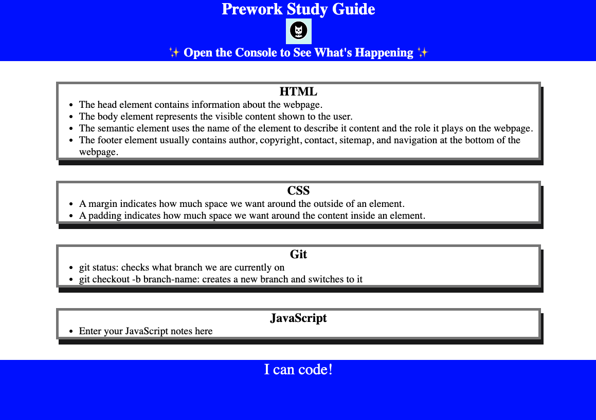

# Prework Study Guide Webpage

## Description

This web application was designed for students completing the bootcamp prework. It is a space to capture highlighted notes on HTML, CSS, Git, Javascript, and other technologies.

- The motivation for creation stems from the pace and plethora of information presented
- The goal and purpose is outline the focus topics
- This application allows students to add organized notes by topic
- The lesson: Organization and accessibility boosts learning efficiency and performance proficiency

## Installation

N/A

## Usage

To use this Prework Study Guide, you can review the notes in each section. For suggestions on what to study first, open the Chrome DevTools by pressing Command+Option+I (macOS) or Control+Shift+I (Windows). A console panel should open either below or to the side of the webpage in the browser. There you will see a list of topics we learned from the prework along with a suggestion on which topic to study first.

## Credits

https://gist.github.com/lukas-h/2a5d00690736b4c3a7ba

https://coding-boot-camp.github.io/full-stack/github/professional-readme-guide

## License

MIT License

Copyright (c) 2023 G6-2Flyy

Permission is hereby granted, free of charge, to any person obtaining a copy
of this software and associated documentation files (the "Software"), to deal
in the Software without restriction, including without limitation the rights
to use, copy, modify, merge, publish, distribute, sublicense, and/or sell
copies of the Software, and to permit persons to whom the Software is
furnished to do so, subject to the following conditions:

The above copyright notice and this permission notice shall be included in all
copies or substantial portions of the Software.

THE SOFTWARE IS PROVIDED "AS IS", WITHOUT WARRANTY OF ANY KIND, EXPRESS OR
IMPLIED, INCLUDING BUT NOT LIMITED TO THE WARRANTIES OF MERCHANTABILITY,
FITNESS FOR A PARTICULAR PURPOSE AND NONINFRINGEMENT. IN NO EVENT SHALL THE
AUTHORS OR COPYRIGHT HOLDERS BE LIABLE FOR ANY CLAIM, DAMAGES OR OTHER
LIABILITY, WHETHER IN AN ACTION OF CONTRACT, TORT OR OTHERWISE, ARISING FROM,
OUT OF OR IN CONNECTION WITH THE SOFTWARE OR THE USE OR OTHER DEALINGS IN THE
SOFTWARE.

---

